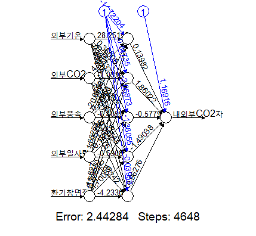
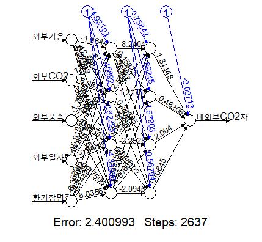
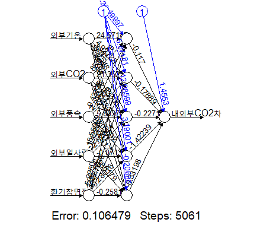
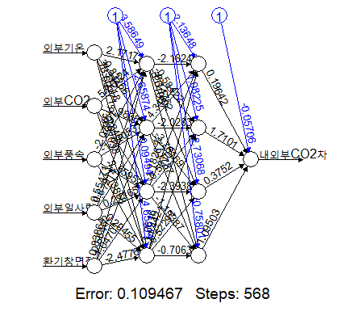

## 목적 : 단동 비닐하우스 환기율 및 온습도에 대한 예측모형 구축 및 평가
## 사용모형 : Multiple Linear Regression Model v.s Artificial Neural Network Model (ANN)

## 1. Loading data (내외부CO2차 반응변수)

- 작물있음 데이터에서 외부CO2의 값이 결측치인 경우는 제외하였음.

```{r}
# setwd("D:/OneDrive - 전북대학교/전북대학교/농림과학원용역/2021")
plantyes <- read.csv("C:/Users/stat/Desktop/작물있음.csv",sep=",",header=T)
plantyes <- plantyes[is.na(plantyes$외부CO2)==FALSE,]
head(plantyes,10)
plantyes$작물유무 <- as.factor(plantyes$작물유무)
plantno <- read.csv("C:/Users/stat/Desktop/작물없음.csv",sep=",",header=T)
head(plantno,10) 
plantno$작물유무 <- as.factor(plantno$작물유무)
plant <- rbind(plantno,plantyes)
```


## Artificial Neural Network Model (ANN)

- ANN의 경우는 작물이 없을 때와 작물이 있을 때로 나누어 각각 모형을 적합하고 분석을 실시한다.
- 모형적합은 데이터에서 임의로 70%를 추출한 train data를 이용하여 만들고 이 모형의 성능을 판단하기 위해 나머지 30%를 test data로 두어서 test RMSE와 SSE/SST를 계산한다. 이 두가지 기준 모두 산출된 값이 작을수록 더 예측력이 좋은 모형이라고 해석할 수 있다.
- $RMSE=\sqrt{{\frac {1}{n} \sum_{i=1}^{n} (y_{i}-\hat{y_{i}})^{2}}}$
- $SSE/SST=\frac {\sum_{i=1}^{n} (y_{i}-\hat{y_{i}})^{2}} {\sum_{i=1}^{n} (y_{i}-\bar{y})^{2}}$
- 추가로 모형적합의 효율성을 위해 주어진 데이터에 대해 최댓값 1, 최솟값 0을 기준으로 하는 표준화를 실시하고 모형을 적합하였다. 그런 다음 실제 예측값은 표준화된 데이터에 의해 산출된 표준화된 예측값에 대해 표준화의 역순으로 환산을 실시하여 구할 수 있다.
- 그리고 분석 의뢰기관의 요청에 따라 환기율은 설명변수에서 제외하였다.

## 3. 작물유무에 따라 데이터를 나누어 적합하는 경우

### Loading packages

```{r}
library(nnet)
library(devtools)
library(neuralnet)
library(NeuralNetTools)
```


### 3.1 작물이 없을 때

- 우선 다음과 같이 데이터를 표준화한다.

```{r}
plantno_scale <- transform(plantno[,c(9,1,7,10,11,13)], 
                           내외부CO2차=(내외부CO2차-min(내외부CO2차))/(max(내외부CO2차)-min(내외부CO2차)),
                           외부기온=(외부기온-min(외부기온))/(max(외부기온)-min(외부기온)),
                           외부CO2=(외부CO2-min(외부CO2))/(max(외부CO2)-min(외부CO2)),
                           외부풍속=(외부풍속-min(외부풍속))/(max(외부풍속)-min(외부풍속)),
                           외부일사량=(외부일사량-min(외부일사량))/(max(외부일사량)-min(외부일사량)),
                           환기창면적=(환기창면적-min(환기창면적))/(max(환기창면적)-min(환기창면적)))
```

#### 첫번째 모형

- 첫번째로 고려한 적합모형은 hidden layer 1개, 각 layer에 대한 node 5개인 모형이다.
- activation function은 `logistic`으로 설정하였다.

```{r}
set.seed(5790)
train.index <- sample(1:nrow(plantno_scale), round(nrow(plantno_scale)*7/10), replace=F)
ex1_train <-as.data.frame(plantno_scale[train.index,])
ex1_test <- as.data.frame(plantno_scale[-train.index,])
set.seed(1234)
ann1 <- neuralnet(내외부CO2차~외부기온+외부CO2+외부풍속+외부일사량+환기창면적, data=ex1_train, hidden=rep(5,1), threshold = 0.01, stepmax = 1e+08, act.fct='logistic')
summary(ann1)
# plot(ann1)
y <- (ex1_test$내외부CO2차)*(max(plantno$내외부CO2차)-min(plantno$내외부CO2차))+min(plantno$내외부CO2차)
y_hat_ann1 <- (compute(ann1, ex1_test)$net.result)*(max(plantno$내외부CO2차)-min(plantno$내외부CO2차))+min(plantno$내외부CO2차)
y_bar <- mean(y)
RMSE <- sqrt(mean((y-y_hat_ann1)^2))
SSE <- sum((y-y_hat_ann1)^2) 
SST <- sum((y-y_bar)^2) 
result <- data.frame(y, y_hat_ann1, y-y_hat_ann1)
colnames(result) <- c('y','yhat','y-yhat')
RMSE # test RMSE
SSE/SST # SSE/SST
head(result,12)
```



- RMSE=11.02353, SSE/SST=0.3783302

#### 두번째 모형

- 두번째로 고려한 적합모형은 hidden layer 2개, 각 layer에 대한 node 4개인 모형이다.
- activation function은 `logistic`으로 설정하였다.

```{r}
set.seed(5790)
train.index <- sample(1:nrow(plantno_scale), round(nrow(plantno_scale)*7/10), replace=F)
ex1_train <-as.data.frame(plantno_scale[train.index,])
ex1_test <- as.data.frame(plantno_scale[-train.index,])
set.seed(1234)
ann1 <- neuralnet(내외부CO2차~외부기온+외부CO2+외부풍속+외부일사량+환기창면적, data=ex1_train, hidden=rep(4,2), threshold = 0.01, stepmax = 1e+08, act.fct='logistic')
summary(ann1)
# plot(ann1)
y <- (ex1_test$내외부CO2차)*(max(plantno$내외부CO2차)-min(plantno$내외부CO2차))+min(plantno$내외부CO2차)
y_hat_ann1 <- (compute(ann1, ex1_test)$net.result)*(max(plantno$내외부CO2차)-min(plantno$내외부CO2차))+min(plantno$내외부CO2차)
y_bar <- mean(y)
RMSE <- sqrt(mean((y-y_hat_ann1)^2))
SSE <- sum((y-y_hat_ann1)^2) 
SST <- sum((y-y_bar)^2) 
result <- data.frame(y, y_hat_ann1, y-y_hat_ann1)
colnames(result) <- c('y','yhat','y-yhat')
RMSE # test RMSE
SSE/SST # SSE/SST
head(result,12)
```



- RMSE=11.34125, SSE/SST=0.4004531
- 적합결과 test RMSE 값이 다중회귀모형(12.8444)과 비교했을 때 비슷하지만 약간 더 작은 값이므로 이 ANN 모형이 다중회귀모형보다 예측력이 좋다고 해석할 수 있다.


### 3.2 작물이 있을 때

- 우선 다음과 같이 데이터를 표준화한다.

```{r}
plantyes_scale <- transform(plantyes[,c(9,1,7,10,11,13)], 
                           내외부CO2차=(내외부CO2차-min(내외부CO2차))/(max(내외부CO2차)-min(내외부CO2차)),
                           외부기온=(외부기온-min(외부기온))/(max(외부기온)-min(외부기온)),
                           외부CO2=(외부CO2-min(외부CO2))/(max(외부CO2)-min(외부CO2)),
                           외부풍속=(외부풍속-min(외부풍속))/(max(외부풍속)-min(외부풍속)),
                           외부일사량=(외부일사량-min(외부일사량))/(max(외부일사량)-min(외부일사량)),
                           환기창면적=(환기창면적-min(환기창면적))/(max(환기창면적)-min(환기창면적)))
```

#### 첫번째 모형

- 첫번째로 고려한 적합모형은 hidden layer 1개, 각 layer에 대한 node 5개인 모형이다.
- activation function은 `logistic`으로 설정하였다.

```{r}
set.seed(5790)
train.index <- sample(1:nrow(plantyes_scale), round(nrow(plantyes_scale)*7/10), replace=F)
ex1_train <- as.data.frame(plantyes_scale[train.index,])
ex1_test <- as.data.frame(plantyes_scale[-train.index,])
set.seed(1234)
ann1 <- neuralnet(내외부CO2차~외부기온+외부CO2+외부풍속+외부일사량+환기창면적, data=ex1_train, hidden=rep(5,1), threshold = 0.01, stepmax = 1e+08, act.fct='logistic')
summary(ann1)
# plot(ann1)
y <- (ex1_test$내외부CO2차)*(max(plantyes$내외부CO2차)-min(plantyes$내외부CO2차))+min(plantyes$내외부CO2차)
y_hat_ann1 <- (compute(ann1, ex1_test)$net.result)*(max(plantyes$내외부CO2차)-min(plantyes$내외부CO2차))+min(plantyes$내외부CO2차)
y_bar <- mean(y)
RMSE <- sqrt(mean((y-y_hat_ann1)^2))
SSE <- sum((y-y_hat_ann1)^2) 
SST <- sum((y-y_bar)^2) 
result <- data.frame(y, y_hat_ann1, y-y_hat_ann1)
colnames(result) <- c('y','yhat','y-yhat')
RMSE # test RMSE
SSE/SST # SSE/SST
head(result,12)
```



- RMSE=4.43485, SSE/SST=0.05313015

#### 두번째 모형

- 두번째로 고려한 적합모형은 hidden layer 2개, 각 layer에 대한 node 4개인 모형이다.
- activation function은 `logistic`으로 설정하였다.

```{r}
set.seed(5790)
train.index <- sample(1:nrow(plantyes_scale), round(nrow(plantyes_scale)*7/10), replace=F)
ex1_train <- as.data.frame(plantyes_scale[train.index,])
ex1_test <- as.data.frame(plantyes_scale[-train.index,])
set.seed(1234)
ann1 <- neuralnet(내외부CO2차~외부기온+외부CO2+외부풍속+외부일사량+환기창면적, data=ex1_train, hidden=rep(4,2), threshold = 0.01, stepmax = 1e+08, act.fct='logistic')
summary(ann1)
# plot(ann1)
y <- (ex1_test$내외부CO2차)*(max(plantyes$내외부CO2차)-min(plantyes$내외부CO2차))+min(plantyes$내외부CO2차)
y_hat_ann1 <- (compute(ann1, ex1_test)$net.result)*(max(plantyes$내외부CO2차)-min(plantyes$내외부CO2차))+min(plantyes$내외부CO2차)
y_bar <- mean(y)
RMSE <- sqrt(mean((y-y_hat_ann1)^2))
SSE <- sum((y-y_hat_ann1)^2) 
SST <- sum((y-y_bar)^2) 
result <- data.frame(y, y_hat_ann1, y-y_hat_ann1)
colnames(result) <- c('y','yhat','y-yhat')
RMSE # test RMSE
SSE/SST # SSE/SST
head(result,12)
```



- RMSE=4.887306, SSE/SST=0.06452415
- 적합결과 test RMSE 값이 다중회귀모형(8.0061)과 비교했을 때 더 작은 값이므로 이 ANN 모형이 다중회귀모형보다 예측력이 좋다고 해석할 수 있다.


